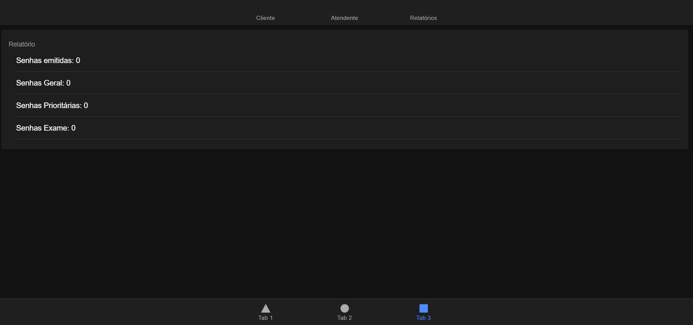
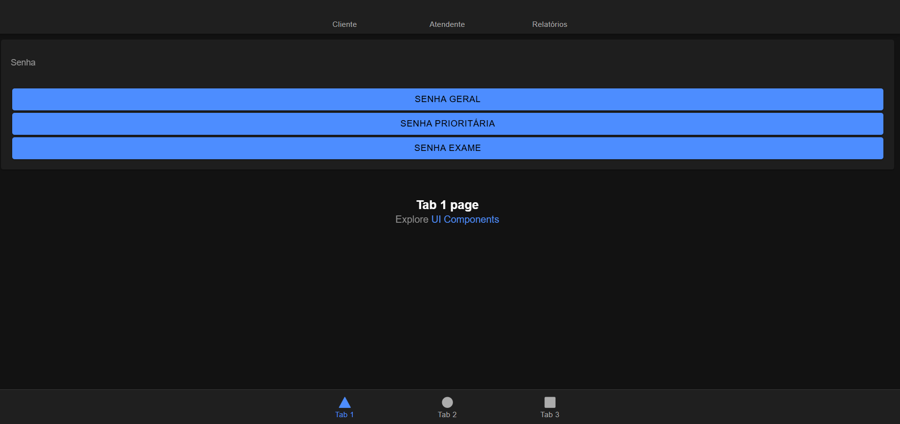
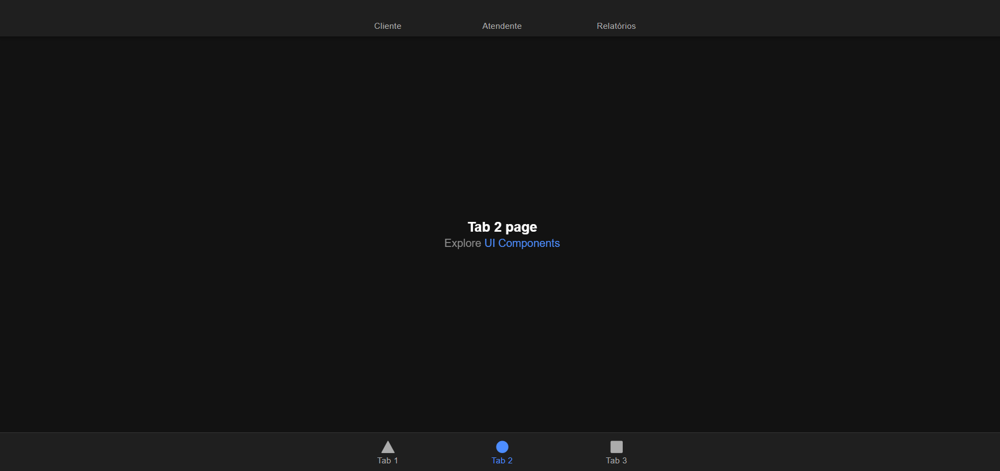

# Sistema-para-controle-de-atendimento-(MobileTicketslonic)
O projeto tem como objetivo testar e refinar as competências adquiridas em sala de aula,
com foco no desenvolvimento de aplicações mobile. Além disso, busca contribuir para a construção de portfólio na área de desenvolvimento,
permitindo a evolução prática das habilidades do aluno, na produção deste prototipo.

---

## Conteúdos aplicados
* 1.Criação de aplicações com Ionic Framework
* 2.Estruturação de projetos utilizando Angular
* 3.Integração com Capacitor para execução em ambiente mobile

---

## Sobre o aplicativo:
Esse aplicativo se trata de um Sistema de Controle de atendimentos em filas de laboratorio. Então sera utilizado um sistema de Senhas para facilitar o atendimento, no qual sera separado em 3 tipos de senhas.


---

## Ferramentas Utilizadas
* 1.GitHub – versionamento do projeto
* 2.Visual Studio Code – ambiente de desenvolvimento
* 3.Ionic Framework – criação da interface da aplicação mobile
* 4.Angular – estrutura e lógica da aplicação
* 5.Capacitor – integração com funcionalidades nativas (Android/iOS) 

| Node.Js | Ionic CLI | Typescript | Angular | Capacitor |
|--------|------|-------|-------|---------|
| <div align="center"></div> | <div align="center"></div> | <div align="center"></div> | <div align="center"></div>| <div align="center"></div>  |
| Node.Js 24.14.1 | V 7.2.1 | V 5.9.0 | V 21.0 | V 8.3.0 |

---


## Como rodar
Pré-requisitos:
* Node.js instalado
* Ionic CLI instalado

Comandos:
* Abra o terminal do Vscode, dentro da pasta "coisa"
* Digitar
```bash
npm install
```
* Depois digite
```bash
ionic serve
```
* Apos isso espere o app abrir, que assim você conseguira visualizar o prototipo

---
## Membros
Aline Guedes (01810669)
João Guilherme (01806083)
Lucas Rodrigo (01809313)

# Prints



